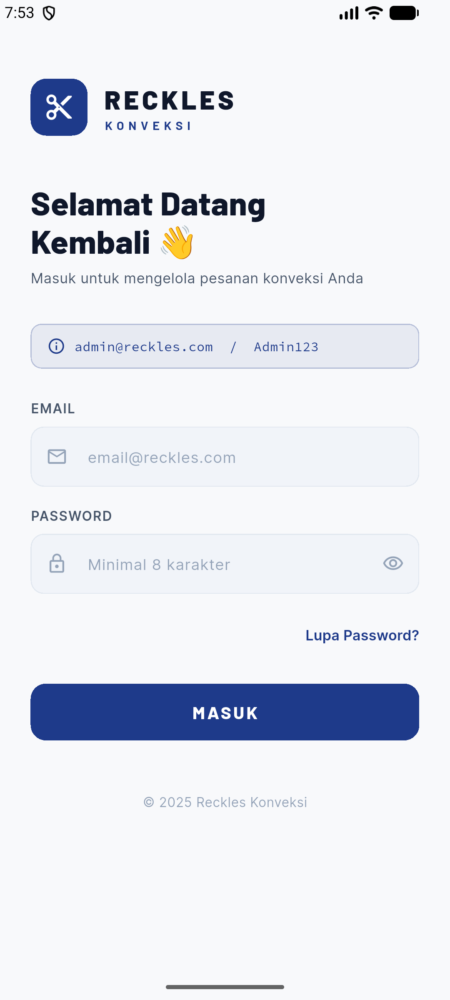
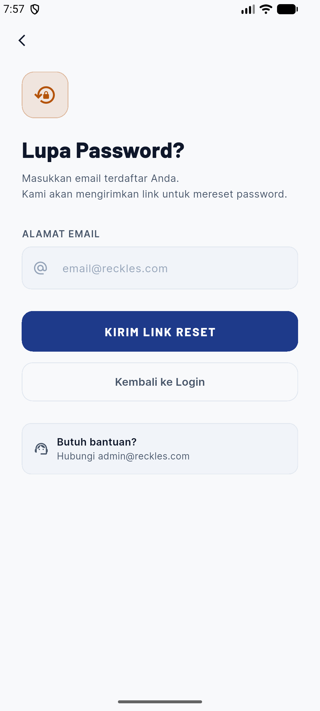
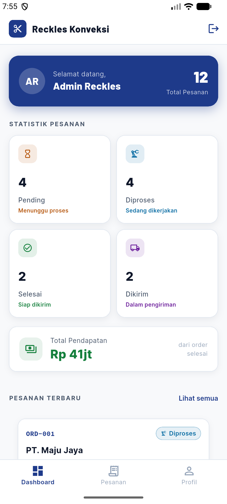
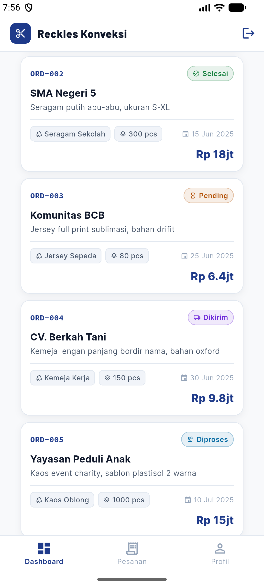
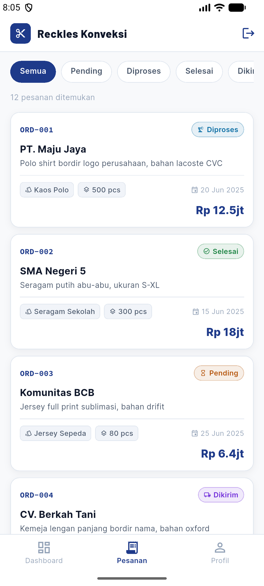
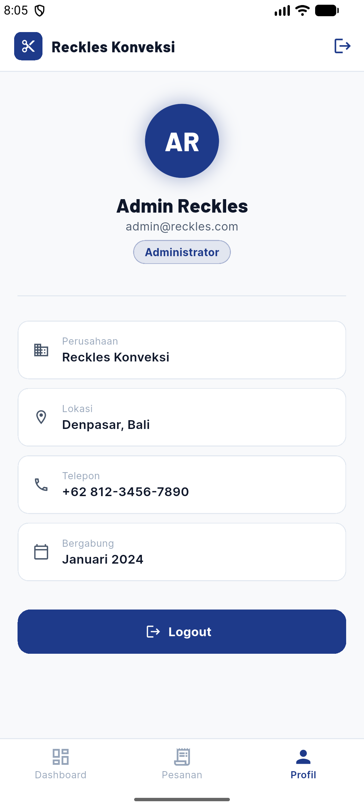

# Reckles Konveksi — Aplikasi Manajemen Konveksi

Aplikasi Flutter untuk manajemen operasional Reckles Konveksi, sebuah platform digital yang memudahkan pengelolaan pesanan, monitoring produksi, dan laporan keuangan bisnis konveksi secara profesional.

---

## Deskripsi Aplikasi

Reckles Konveksi App adalah aplikasi mobile berbasis Flutter yang dirancang untuk membantu tim internal konveksi dalam:
- Mengelola dan memantau pesanan pelanggan
- Melihat status produksi secara real-time
- Merangkum statistik pesanan dan pendapatan
- Mengelola akses pengguna (Admin & Staff)

---

## Daftar Fitur

### Halaman 1 — Login Screen 
- Form login dengan field Email dan Password
- Validasi client-side dengan `Form`, `TextFormField`, `GlobalKey<FormState>`
  - Email: tidak boleh kosong, regex format email
  - Password: tidak boleh kosong, minimal 8 karakter, mengandung huruf & angka
- State management menggunakan `InheritedWidget` + `setState` untuk:
  - `isLoading` — loading indicator saat proses login
  - `errorMessage` — tampil saat login gagal
  - `isPasswordVisible` — toggle show/hide password
- Tombol Login dengan `CircularProgressIndicator` saat loading
- Link "Lupa Password?" -> navigasi ke Halaman 2 via `Navigator.pushNamed`
- SnackBar untuk pesan error dan sukses
- Navigasi ke Dashboard setelah login sukses via `Navigator.pushReplacementNamed`
- Animasi fade + slide saat halaman pertama kali dibuka

### Halaman 2 — Lupa Password Screen 
- Form input email dengan validasi format
- Tombol "Kirim Link Reset" dengan loading state
- SnackBar konfirmasi "Link reset telah dikirim ke email Anda"
- State `isEmailSent` menampilkan card konfirmasi visual
- Tombol "Kembali ke Login" menggunakan `Navigator.pop`
- Layout: `Column`, `Padding`, `SizedBox`, `SafeArea`

### Halaman 3 — Dashboard Screen 
- AppBar dengan judul dan tombol logout (`Icons.logout`)
- Tampilan "Selamat datang, {nama user}" dari state `InheritedWidget`
- `GridView.count` untuk 4 stat card (Pending, Diproses, Selesai, Pendapatan)
- `ListView.builder` dengan 12+ item dummy pesanan konveksi
- `Card` dengan shadow, rounded corner, padding di setiap order item
- Dialog konfirmasi sebelum logout
- Logout menggunakan `Navigator.pushNamedAndRemoveUntil`
- Bottom Navigation Bar dengan 3 tab: Dashboard, Pesanan, Profil
- Filter pesanan berdasarkan status (Semua / Pending / Diproses / Selesai / Dikirim)
- Tab Profil dengan informasi user yang sedang login

---

## Kredensial Demo

| Role | Email | Password |
|------|-------|----------|
| Admin | `admin@reckles.com` | `Admin123` |
| Staff | `staff@reckles.com` | `Staff123` |

---

## Cara Menjalankan Aplikasi

### Syarat
- Flutter SDK ≥ 3.0.0 (stable)
- Dart SDK ≥ 3.0.0
- Android Studio / VS Code dengan Flutter extension

### Langkah-langkah

```bash
# 1. Clone repository
git clone https://github.com/Cakraa26/reckleskonveksi-mobile.git
cd reckleskonveksi-mobile

# 2. Install dependencies
flutter pub get

# 3. Jalankan aplikasi
flutter run

# Atau untuk build release APK
flutter build apk --release
```

---

## Package yang Digunakan

| Package | Versi | Alasan Penggunaan |
|---------|-------|-------------------|
| `google_fonts` | ^6.1.0 | Memberikan tampilan tipografi yang profesional dan khas menggunakan font Barlow (headline) dan Inter (body) dari Google Fonts. Meningkatkan kualitas visual UI dibanding font sistem default. |
| `cupertino_icons` | ^1.0.6 | Icon set iOS untuk konsistensi tampilan di perangkat Apple (sudah termasuk dalam default Flutter template). |

## Screenshot

> Screenshot halaman.
<!-- 1. Halaman Login -->


<!-- 2. Lupa Password -->


<!-- 3. Dashboard -->



<!-- 4. Bottom Navigation Bar (opsional) -->



---

## Developer

Nama: Ni Luh Komang Gd Cakra Dewi
NIM: 2401010774
Mata Kuliah: Praktikum Pemrograman Mobile  
Semester: 4